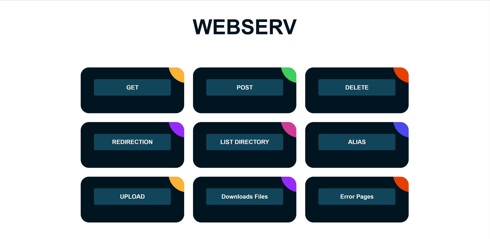

# 🌐 Webserv - HTTP Server in C++

A lightweight, HTTP/1.1 compliant web server written in C++98, inspired by NGINX. This project implements core web server functionality including multi-server support, CGI execution, file uploads, and comprehensive HTTP method handling.

---

## 📋 Table of Contents

- [Features](#-features)
- [Requirements](#-requirements)
- [Installation](#-installation)
- [Usage](#-usage)
- [Configuration](#-configuration)
- [Testing the Server](#-testing-the-server)
- [Project Structure](#-project-structure)
- [Contributors](#-contributors)

---

## ✨ Features

### Core Functionality
- **Non-blocking I/O** - Efficient multiplexing with `poll()` or equivalent
- **Multiple Server Support** - Run multiple servers on different ports simultaneously
- **HTTP/1.1 Compliance** - Support for GET, POST, and DELETE methods
- **File Upload** - Handle client file uploads
- **Redirections** - HTTP redirections (301, 302, etc.)
- **Directory Listing** - Auto-indexing for directory browsing
- **Location-based Routing** - Custom routes with different configurations
- **Custom Error Pages** - Serve custom HTML error pages (404, 403, 500, etc.)
- **CGI Support** - Execute CGI scripts (.cgi files)
- **Request Body Size Limiting** - Configurable max body size per server

### HTTP Methods
- **GET** - Retrieve resources
- **POST** - Submit data and upload files
- **DELETE** - Remove resources from the server

---

## 🔧 Requirements

- **C++ Compiler** - C++14 or higher
- **Make** - GNU Make
- **Operating System** - Linux, macOS, or Windows (with WSL)

---

## 📦 Installation

1. **Clone the repository**
   ```bash
   git clone https://github.com/Omhs-dev/Webserv0.1.git
   cd Webserv0.1
   ```

2. **Compile the project**
   ```bash
   make
   ```

3. **Clean build files** (optional)
   ```bash
   make clean    # Remove object files
   make fclean   # Remove object files and executable
   make re       # Rebuild everything
   ```

---

## 🚀 Usage

### Starting the Server

**Default Configuration** (uses `config/test.conf`):
```bash
./webserv
```

**Custom Configuration File**:
```bash
./webserv config/webserv.conf
```

### Accessing the Server

Once the server is running, open your web browser and navigate to:
```
http://localhost:8090
```

You'll see the homepage with various testing options.

---

## ⚙️ Configuration

The server uses NGINX-style configuration files. Here's a basic example:

```nginx
http {
    server {
        listen 8090
        server_name localhost
        root ./www
        index index.html
        max_body_size 10000000

        error_page 404 ./www/pages/404.html
        error_page 403 ./www/pages/403.html
        error_page 500 ./www/pages/500.html

        location / {
            allow_methods GET POST
            root ./www
            index index.html
        }

        location /uploads/ {
            allow_methods GET POST DELETE
            root ./www
            autoindex on
        }

        location /github/ {
            return 301 https://github.com/
        }

        location /alias/ {
            alias ./www/aliaspath/pathone/
            index alias.html
            allow_methods GET
        }

        location /cgi-bin/ {
            allow_methods GET POST
            root ./www/cgi-bin
            autoindex on
        }
    }
}
```

### Configuration Directives

| Directive | Description | Example |
|-----------|-------------|---------|
| `listen` | Port number to listen on | `listen 8080` |
| `server_name` | Server hostname | `server_name localhost` |
| `root` | Root directory for serving files | `root ./www` |
| `index` | Default index file | `index index.html` |
| `max_body_size` | Maximum request body size in bytes | `max_body_size 10000000` |
| `error_page` | Custom error page for HTTP status codes | `error_page 404 ./www/pages/404.html` |
| `allow_methods` | Allowed HTTP methods for a location | `allow_methods GET POST DELETE` |
| `autoindex` | Enable/disable directory listing | `autoindex on` |
| `return` | HTTP redirection | `return 301 https://example.com/` |
| `alias` | Map URL to different filesystem path | `alias ./www/other/path/` |

---

## 🧪 Testing the Server

### Homepage Overview



The homepage provides easy access to test different server features:

### 1. **GET Method** 📥
Test retrieving resources from the server.
- Navigate to the GET test page
- Request various file types (HTML, images, text files)
- Test directory listing with autoindex

**Example:**
```bash
curl http://localhost:8090/index.html
curl http://localhost:8090/images/
```

### 2. **POST Method** 📤
Test sending data to the server.
- Submit forms
- Upload files
- Test with different content types

**Example:**
```bash
curl -X POST -d "name=test&value=123" http://localhost:8090/uploads/
curl -X POST -F "file=@myfile.txt" http://localhost:8090/uploads/
```

### 3. **DELETE Method** 🗑️
Test resource deletion.
- Delete uploaded files
- Verify proper permission handling

**Example:**
```bash
curl -X DELETE http://localhost:8090/uploads/test.txt
```

### 4. **Redirection** 🔁
Test HTTP redirections.
- Click the redirection button to be redirected to GitHub
- Verify 301 redirect status

**URL:** `http://localhost:8090/github/`

### 5. **Directory Listing** 📂
Test autoindex feature.
- Browse directories with autoindex enabled
- Navigate through nested folders

**URL:** `http://localhost:8090/listening/`

### 6. **Alias** 🔗
Test path aliasing.
- Access resources through aliased paths
- Verify correct file resolution

**URL:** `http://localhost:8090/alias/`

### 7. **File Upload** ⬆️
Test file upload functionality.
- Upload files through web interface
- Test maximum body size limits
- Verify uploaded files in the uploads directory

**URL:** `http://localhost:8090/pages/upload.html`

### 8. **File Download** ⬇️
Test file serving and downloads.
- Browse uploaded files
- Download files through the browser

**URL:** `http://localhost:8090/uploads/`

### 9. **Error Pages** ⚠️
Test custom error page handling.
- Access non-existent pages (404)
- Test forbidden resources (403)
- Trigger method not allowed (405)
- Test server errors (500)

**Examples:**
```bash
curl http://localhost:8090/nonexistent      # 404
curl -X PUT http://localhost:8090/          # 405 Method Not Allowed
```

### 10. **CGI Execution** ⚙️
Test CGI script execution.
- Execute CGI scripts with GET parameters
- Submit forms to CGI scripts (POST)
- View CGI output in browser

**URL:** `http://localhost:8090/cgi-bin/`

---

## 📁 Project Structure

```
Webserv0.1/
├── config/                 # Configuration files
│   ├── test.conf          # Main test configuration
│   └── webserv.conf       # Alternative configuration
├── include/               # Header files
│   ├── ConfigParser.hpp
│   └── Webserv.hpp
├── src/                   # Source files
│   ├── main.cpp
│   ├── CGI/              # CGI handler
│   ├── Logger/           # Logging system
│   ├── Parse/            # Configuration parser
│   ├── Request/          # HTTP request parser
│   ├── Response/         # HTTP response handler
│   ├── Server/           # Server and client management
│   └── Socket/           # Socket operations
├── www/                   # Web root directory
│   ├── index.html        # Homepage
│   ├── pages/            # HTML pages
│   ├── cgi-bin/          # CGI scripts
│   ├── uploads/          # Upload directory
│   ├── downloads/        # Download directory
│   └── images/           # Image assets
├── Makefile              # Build configuration
└── README.md             # This file
```

---

## 🛠️ Advanced Testing

### Using cURL

**GET Request:**
```bash
curl -v http://localhost:8090/
```

**POST Request with Data:**
```bash
curl -X POST -d "key1=value1&key2=value2" http://localhost:8090/cgi-bin/create_user.cgi
```

**File Upload:**
```bash
curl -X POST -F "file=@/path/to/file.txt" http://localhost:8090/uploads/
```

**DELETE Request:**
```bash
curl -X DELETE http://localhost:8090/uploads/file.txt
```

**Test Redirects:**
```bash
curl -L http://localhost:8090/github/
```

### Using Siege (Load Testing)

```bash
# Install siege
sudo apt-get install siege  # Linux
brew install siege          # macOS

# Run load test
siege -c 10 -t 30S http://localhost:8090/
```

### Browser Testing

1. Open multiple tabs to test concurrent connections
2. Use browser developer tools (F12) to inspect requests/responses
3. Test file uploads through the web interface
4. Verify error pages display correctly

---

## 🐛 Troubleshooting

### Port Already in Use
If you get a "port already in use" error:
```bash
# Linux/macOS
lsof -i :8090
kill -9 <PID>

# Windows (PowerShell)
netstat -ano | findstr :8090
taskkill /PID <PID> /F
```

### Configuration File Errors
- Ensure proper syntax (check brackets, semicolons)
- Verify file paths are correct and accessible
- Check that the `http {` block is properly formatted

### File Upload Issues
- Verify `max_body_size` is large enough
- Check upload directory has write permissions
- Ensure the location allows POST method

---

## 👥 Contributors

<div align="center">

| Developer | GitHub |
|-----------|--------|
| **Omhs** | [@Omhs-dev](https://github.com/Omhs-dev) |
| **Valentin** | [@Valentinoszadcsij](https://github.com/Valentinoszadcsij) |
| **Narcisse** | [@NarcisseObadiah](https://github.com/NarcisseObadiah) |

</div>

---

## 📄 License

This project is part of the 42 school curriculum.

---

## 🙏 Acknowledgments

- Inspired by NGINX configuration syntax
- Built as part of the 42 Network educational program
- HTTP/1.1 specification: [RFC 2616](https://www.rfc-editor.org/rfc/rfc2616)

---

<div align="center">

**⭐ If you find this project useful, please consider giving it a star! ⭐**

Made with ❤️ by the Webserv Team

</div>
